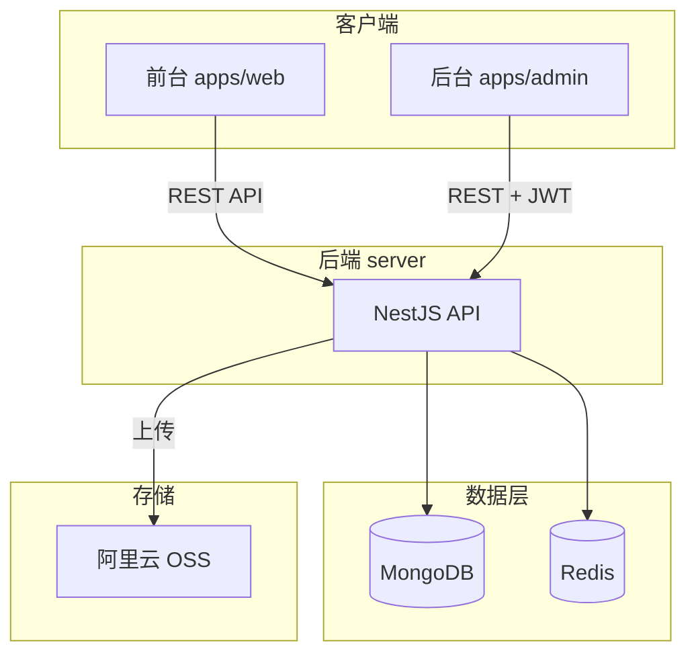

# Vibe Coding 作品集网站全栈实现计划

## 现状

项目当前仅有 [README.md](README.md)，无任何源码。需从零搭建 monorepo 结构及前后端应用。

## 架构概览

---

## 第一阶段：项目骨架与共享层

### 1.1 Monorepo 初始化

- 根目录 `package.json`：pnpm workspace 配置，scripts（dev/build/lint）
- `pnpm-workspace.yaml`：`apps/*`、`packages/*`、`server`
- 根目录 `.eslintrc`、`.prettierrc`、`tsconfig.base.json`

### 1.2 共享包 `packages/shared`

- 类型定义：`Project`、`Category`、`User` 等
- 常量：API 路径、状态枚举
- 供 `apps/web`、`apps/admin`、`server` 引用

### 1.3 环境变量模板

- `server/.env.example`、`apps/web/.env.example`、`apps/admin/.env.example`
- 开发阶段使用 `.env.local`，数据库/Redis 指向本地或 Docker

---

## 第二阶段：后端 API (server)

### 2.1 NestJS 基础

- 新建 Nest 项目，配置 TypeScript、Mongoose、Redis
- `src/main.ts`：CORS、全局前缀 `/api/v1`、Swagger
- `src/database/`：MongoDB、Redis 连接与模块

### 2.2 数据模型（Mongoose Schemas）

| Schema     | 核心字段                                                                                                                                       |
| ---------- | ------------------------------------------------------------------------------------------------------------------------------------------ |
| `Project`  | title, slug, description, content (Markdown), coverImage, media (图片/视频 URL), codeSnippets, categoryIds, tags, status, sortOrder, createdAt |
| `Category` | name, slug, icon, sortOrder                                                                                                                |
| `User`     | email, passwordHash, role                                                                                                                  |

### 2.3 业务模块

- **auth**：登录（JWT）、登出、Token 刷新、Guard
- **project**：CRUD、分页、按分类/标签筛选、按 slug 查详情
- **category**：CRUD、树形结构（如需）
- **upload**：本地暂存 / OSS 预留接口（开发期返回模拟 URL）
- **user**：管理员 CRUD（需 admin 权限）

### 2.4 安全与限流

- JWT Guard、限流（`@nestjs/throttler`）、Class Validator DTO 校验
- 文件上传：类型、大小限制

---

## 第三阶段：前台展示 (apps/web)

### 3.1 工程初始化

- Vue 3 + Vite + TypeScript + Vue Router + Pinia + Tailwind CSS
- 配置 `@vueuse/core`、`axios`、`vue-router`、GSAP

### 3.2 核心页面与路由

| 路由                | 页面            | 说明                        |
| ----------------- | ------------- | ------------------------- |
| `/`               | Home          | Hero、精选作品、CTA             |
| `/projects`       | ProjectList   | 作品列表、分页、分类/标签筛选           |
| `/projects/:slug` | ProjectDetail | 详情：图片/视频/代码片段、Markdown 内容 |
| `/about`          | About         | 个人简介                      |
| `/contact`        | Contact       | 联系方式表单                    |

### 3.3 公共组件

- `Layout`、`Header`、`Footer`、`ThemeToggle`（深色/浅色）
- `ProjectCard`：封面、标题、摘要、标签
- `ProjectGrid`：响应式网格
- `MediaViewer`：图片懒加载、视频播放
- `CodeSnippet`：语法高亮（如 `highlight.js` 或 `shiki`）

### 3.4 性能与 SEO

- 图片懒加载、路由懒加载
- `index.html`  meta、`vue-meta` 或 `@unhead/vue` 动态 title/description
- 预留 SSG/SSR 扩展点（Vite SSR 或 Nuxt 迁移路径）

### 3.5 设计规范（按 README）

- Tailwind 配置：主色 primary、断点 sm/md/lg/xl/2xl
- 移动端优先、响应式布局

---

## 第四阶段：后台管理 (apps/admin)

### 4.1 工程初始化

- Vue 3 + Vite + TypeScript + Element Plus + Vue Router + Pinia + Axios

### 4.2 核心页面

| 路由                    | 页面           | 功能                                                              |
| --------------------- | ------------ | --------------------------------------------------------------- |
| `/login`              | Login        | 邮箱密码登录                                                          |
| `/`                   | Dashboard    | 作品数量、访问统计（可先用占位）                                                |
| `/projects`           | ProjectList  | 列表、搜索、新建/编辑/删除                                                  |
| `/projects/edit/:id?` | ProjectEdit  | 表单 + 富文本（Markdown 编辑器，如 `@toast-ui/vue-editor` 或 `v-md-editor`） |
| `/categories`         | CategoryList | 分类 CRUD                                                         |
| `/upload`             | Upload       | 文件上传（开发期模拟）                                                     |

### 4.3 认证与路由守卫

- 登录后存储 JWT，请求头携带
- 未登录重定向到 `/login`

---

## 第五阶段：对接与优化

### 5.1 API 对接

- `apps/web`、`apps/admin` 通过 `VITE_API_BASE_URL` 调用后端
- 统一错误处理、loading 状态

### 5.2 数据与部署准备

- `server` 添加 `db:seed` 脚本，插入示例作品与分类
- `docker-compose.yml`：MongoDB、Redis、可选 Nginx
- 环境变量文档补充云部署说明（MongoDB Atlas、阿里云 OSS 等）

---

## 推荐实施顺序

1. **Phase 1**：Monorepo + shared + server 骨架 + Project/Category CRUD API
2. **Phase 2**：apps/web 骨架 + 首页 + 作品列表 + 详情页（含图片/视频/代码）
3. **Phase 3**：auth 模块 + apps/admin 登录 + 作品管理
4. **Phase 4**：分类筛选、上传模块、SEO、主题切换、contact 表单
5. **Phase 5**：Docker、seed、部署文档

---

## 关键依赖版本（与 README 一致）

- 前端：Vue ^3.4、Vite ^5、Tailwind ^3.4、Element Plus ^2.5
- 后端：NestJS ^10、Mongoose ^8、Redis ^7
- Node >= 18，pnpm >= 8

---

## 可选简化（开发阶段）

- Redis：可先不用，会话/缓存用内存
- OSS：上传接口返回占位 URL，前端显示占位图
- MongoDB Atlas：可先用本地 MongoDB 或 Docker

